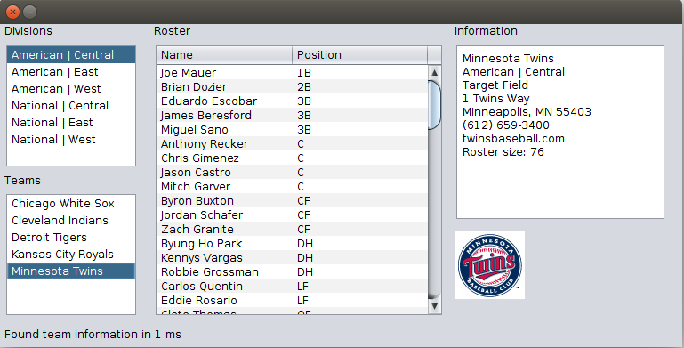

# Database Management Systems (CS440)

This repository contains sample code and project templates for the DBMS course at Luther College.

# Project 1: Athletics

* Write data from csv, json, txt files into an SQLite database
* Read data from the database and populate the fields in the provided GUI
* Implementation language: Java
* Testing: jUnit (provided)

## References 
 * [Overview (Java Platform SE 8 )](http://docs.oracle.com/javase/8/docs/api/)
 * [The Java Tutorials](https://docs.oracle.com/javase/tutorial/)
 * [Designing a Swing GUI in NetBeans IDE - Tutorial](https://netbeans.org/kb/docs/java/quickstart-gui.html)
 * [DB Browser for SQLite](http://sqlitebrowser.org/)
 * [SQLite Tutorial - javatpoint](https://www.javatpoint.com/sqlite-tutorial)
 * [SQlite Java - How To Use JDBC To Interact with SQLite](http://www.sqlitetutorial.net/sqlite-java/)
 * [FasterXML/jackson-docs: Documentation for the Jackson JSON processor.](https://github.com/FasterXML/jackson-docs/)
 * [opencsv - General](http://opencsv.sourceforge.net/)
 * [JUnit - About](http://junit.org/junit4/)
 * [NBA Basketball Teams - National Basketball Association - ESPN](http://www.espn.com/nba/teams)
 * [MLB Baseball Teams - Major League Baseball - ESPN](http://www.espn.com/mlb/teams)

# Project 2: Relational

* Extend the [Relational](https://ltworf.github.io/relational/) project to process relational algebra operations as described in the textbook.
* Each **team** will implement one single-table operation and one 2-table operation.
    1. select, project, rename, sort, extend, groupby
    1. product, join, semijoin, antijoin, union, outer join
* Implementation language: Python

## References
* [Relational algebra - Wikipedia](https://en.wikipedia.org/wiki/Relational_algebra)
* [Relational](https://ltworf.github.io/relational/)
* [The Python Standard Library — Python 3.6.2 documentation](https://docs.python.org/3/library/index.html)
